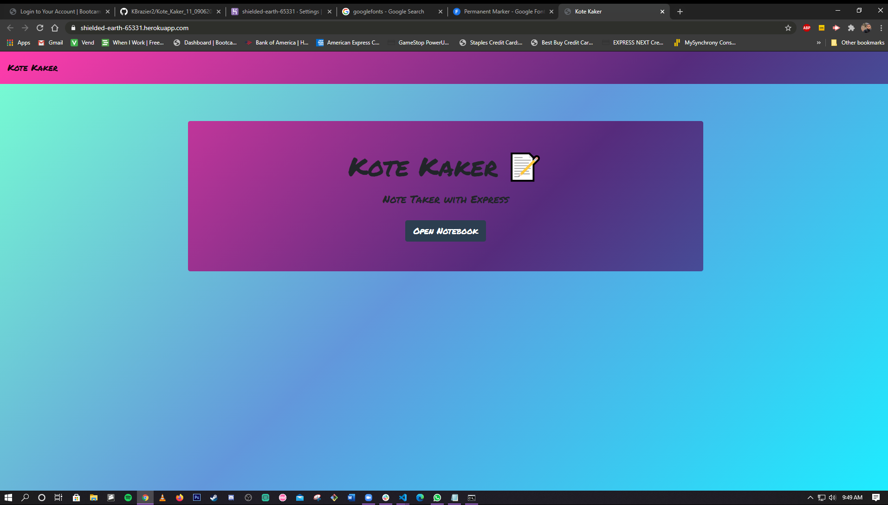
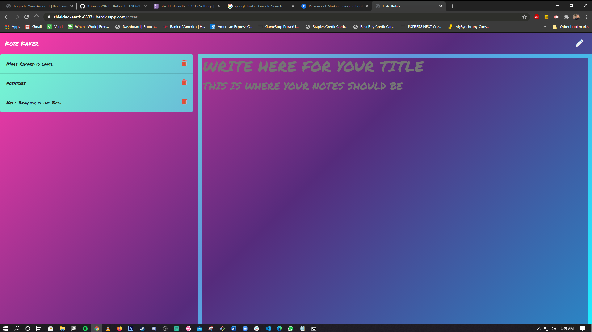
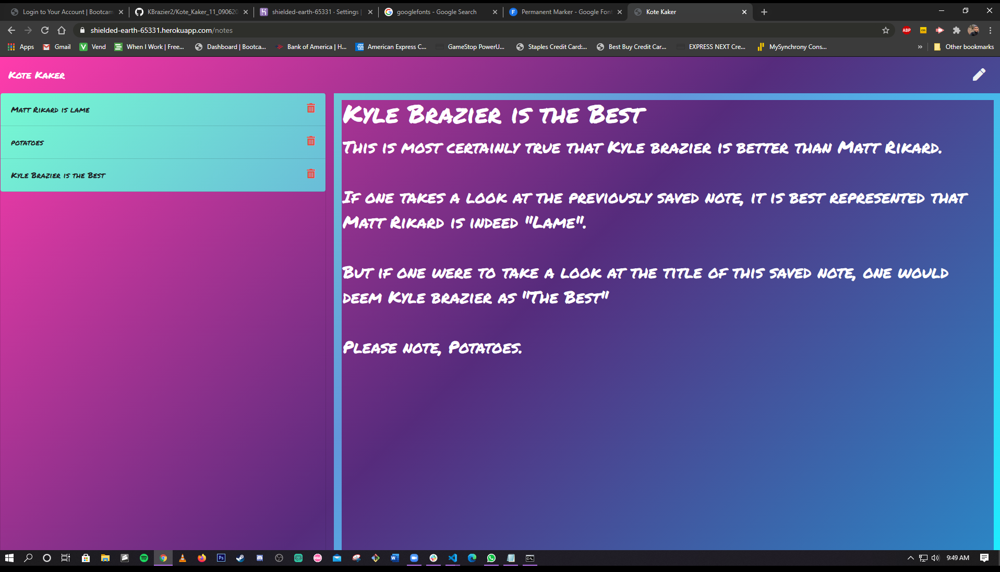

# Kote Kaker 11

## Table of Contents

[Description](#Description)

[Installation](#Installation)

[Usage](#Usage)

[Licenses](#Licenses)

[Contributors](#Contributors)

[Tests](#Tests)

[Questions](#Questions)

[Link](#Link)

[Screenshots](#Screenshots)

## Description

For this assignment, we were tasked with creating a note taker application that could be used to write, save, and delete notes. This application will use an express backend to save and retrieve note data from a JSON file.

## Installation

N/A

## Usage

N/A

## Licenses

N/A

## Contributors

Kyle Brazier

## Tests

N/A

## Questions

You may reach me at kylebrazier@gmail.com for further questions.

## Link to Deployed Application

https://kote-kaker-11-09062020.herokuapp.com/

## Screenshots

